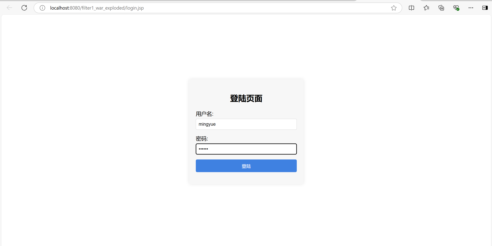
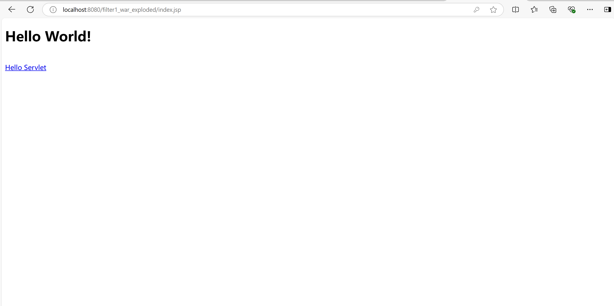
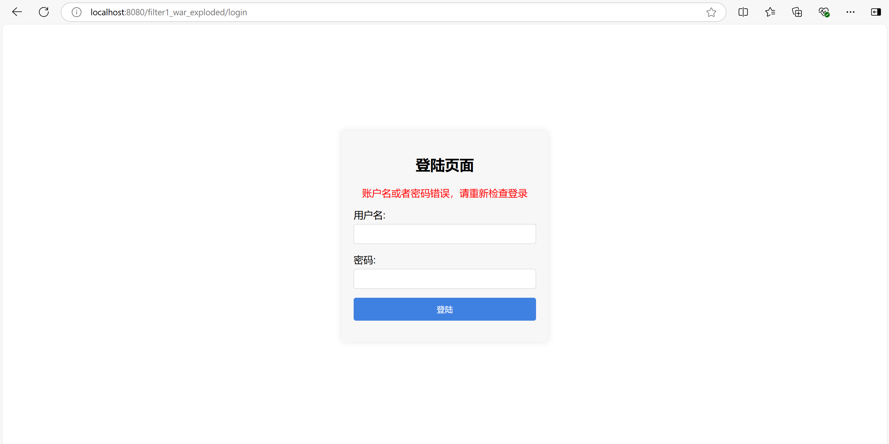

# 作业二：Filter练习

学院：省级示范性软件学院

题目：《作业二：Filter练习》

姓名：翁未未

学号：2200770273

班级：软工2202

日期：2024-10-06

实验环境：lntellij IDEA 2024.2.0.2和Tomcat10.1.28

## 一、作业要求

**题目:** 实现一个登录验证过滤器

**目标:** 创建一个 Servlet的 过滤器,用于验证用户是否已登录。对于未登录的用户,将其**重定向**到登录页面。

**要求:**

1. 创建一个名为 `LoginFilter` 的类, 实现 `javax.servlet.Filter` 接口。

2. 使用 `@WebFilter` 注解配置过滤器,使其应用于所有 URL 路径 ("/*")。

3. 在 `doFilter` 方法中实现以下逻辑:

   a.检查当前请求是否是对登录页面、注册页面或公共资源的请求。如果是,则允许请求通过。

   b.如果不是上述情况,检查用户的 session 中是否存在表示已登录的属性(如 "user" 属性)。

   c.如果用户已登录,允许请求继续。

   d.如果用户未登录,将请求重定向到登录页面。

4. 创建一个排除列表,包含不需要登录就能访问的路径(如 "/login", "/register", "/public")。

5. 实现一个方法来检查当前请求路径是否在排除列表中。

6. 添加适当的注释,解释代码的主要部分。


**提交要求:**

1. LoginFilter.java 文件
2. 一个简短的文档,解释你的实现和任何额外的功能

**评分标准:**

- 正确实现基本的过滤器功能 (70%)
- 代码质量和组织结构 (20%)
- 注释的质量和清晰度 (10%)

**截止日期:** 2024-10-13

## 二、作业内容

`LoginFilter` 是一个用于验证用户登录状态的Servlet过滤器。如果用户未登录，该过滤器将重定向用户到登录页面。这个过滤器通过实现 `javax.servlet.Filter` 接口，并使用 `@WebFilter(urlPatterns = "/*")` 注解，确保它能够应用于应用中所有的URL路径。

`LoginFilter` 的核心功能是在用户尝试访问受限资源前验证其登录状态，所以定义了一个排除列表，其中包含了用户在未登录状态下也可以访问的路径，例如登录页面、注册页面和一些公共资源。

在过滤器的初始化阶段，通过`init` 方法设置了这个排除列表。当一个请求到达时，`doFilter` 方法会被调用，在这个方法中，首先检查请求的路径是否在排除列表中，如果是，请求将被允许继续向下执行，如果不是，进一步检查用户的会话中是否存在表示已登录的属性，例如 "user"。

如果会话中存在 "user" 属性，这意味着用户已经登录，因此请求将被允许继续。如果会话中不存在 "user" 属性，用户将被视为未登录，此时请求将被重定向到登录页面。此外，还实现了一个辅助方法`isExcluded`，它通过检查当前请求路径是否在排除列表中来决定是否放行请求。

`LoginFilter.java`

```
package com.gzu.filter1;

import jakarta.servlet.*;
import jakarta.servlet.annotation.WebFilter;
import jakarta.servlet.http.HttpServletRequest;
import jakarta.servlet.http.HttpServletResponse;
import jakarta.servlet.http.HttpSession;

import java.io.IOException;
import java.util.Arrays;
import java.util.List;
import java.util.logging.Logger;

@WebFilter(urlPatterns = "/*") // 应用到所有URL路径
public class LoginFilter implements Filter {

    private List<String> excludePaths;
    private static final Logger LOGGER = Logger.getLogger(LoginFilter.class.getName());

    public void init(FilterConfig filterConfig) throws ServletException {
        // 初始化排除列表
        excludePaths = Arrays.asList("/login", "/login.jsp","/public.jsp","/pictures/*");
    }

    public void doFilter(ServletRequest request, ServletResponse response, FilterChain chain) throws IOException, ServletException {
        HttpServletRequest req = (HttpServletRequest) request;
        HttpServletResponse res = (HttpServletResponse) response;

        // 获取完整的请求路径
        String path = req.getRequestURI();
        String contextPath = req.getContextPath();

        // 检查当前请求路径是否在排除列表中
        if (isExcluded(path, contextPath)) {
            chain.doFilter(request, response);
        } else {
            HttpSession session = req.getSession(false);
            if (session != null && session.getAttribute("user") != null) {
                // 用户已登录，继续请求
                chain.doFilter(request, response);
            } else {
                // 用户未登录，重定向到登录页面
                res.sendRedirect(res.encodeRedirectURL(contextPath + "/login.jsp"));
            }
        }
    }
    public void destroy() {
        // 清理资源
    }

    private boolean isExcluded(String path, String contextPath) {
        // 检查当前请求路径是否在排除列表中
        return excludePaths.stream().anyMatch(p -> path.startsWith(contextPath + p));
    }
}

```

`loginServlet.java`

```
package com.gzu.filter1;

import jakarta.servlet.ServletException;
import jakarta.servlet.annotation.WebServlet;
import jakarta.servlet.http.HttpServlet;
import jakarta.servlet.http.HttpServletRequest;
import jakarta.servlet.http.HttpServletResponse;
import jakarta.servlet.http.HttpSession;

import java.io.IOException;

@WebServlet("/login")
public class LoginServlet extends HttpServlet {
    @Override
    protected void doPost(HttpServletRequest req, HttpServletResponse resp) throws ServletException, IOException {
        // 获取表单数据
        String username = req.getParameter("username");
        String password = req.getParameter("password");

        // 登录验证逻辑
        if ("mingyue".equals(username) && "123456".equals(password)) {
            // 登录成功，将用户信息存储在session中
            HttpSession session = req.getSession();
            session.setAttribute("user", username);

            resp.sendRedirect(req.getContextPath() + "/index.jsp");
        } else {
            // 登录失败，设置错误消息
            req.setAttribute("errorMessage", "账户名或者密码错误，请重新检查登录");
            // 转发回登录页面，显示错误消息
            req.getRequestDispatcher("/login.jsp").forward(req, resp);
        }
    }

    @Override
    protected void doGet(HttpServletRequest request, HttpServletResponse response) throws ServletException, IOException {
        // 对于GET请求，转发到登录页面
        request.getRequestDispatcher("/login.jsp").forward(request, response);
    }
}

```

`login.jsp`

```
<%--
  Created by IntelliJ IDEA.
  User: mingyue729
  Date: 2024/10/6
  Time: 14:39
  To change this template use File | Settings | File Templates.
--%>
<%@ page contentType="text/html; charset=UTF-8" pageEncoding="UTF-8" %>
<!DOCTYPE html>
<html>
<head>
  <title>登录</title>
  <style>
    body, html {
      height: 100%;
      margin: 0;
      display: flex;
      justify-content: center;
      align-items: center;
      font-family: Arial, sans-serif;
    }
    .login-container {
      width: 300px;
      padding: 20px;
      box-shadow: 0 0 10px rgba(0, 0, 0, 0.1);
      border-radius: 5px;
      background: #f7f7f7;
    }
    .login-container h2 {
      text-align: center;
      margin-bottom: 20px;
    }
    .login-container .error-message {
      text-align: center;
      color: red;
      margin-bottom: 15px;
    }
    .login-container form div {
      margin-bottom: 15px;
    }
    .login-container label {
      display: block;
      margin-bottom: 5px;
    }
    .login-container input[type="text"],
    .login-container input[type="password"] {
      width: 100%;
      padding: 8px;
      border: 1px solid #ccc;
      border-radius: 4px;
      box-sizing: border-box;
    }
    .login-container button {
      width: 100%;
      padding: 10px;
      border: none;
      border-radius: 4px;
      background-color: #3f81e1;
      color: white;
      cursor: pointer;
    }
    .login-container button:hover {
      background-color: #1869bf;
    }
  </style>
</head>
<body>
<div class="login-container">
  <h2>登陆页面</h2>
  <% if (request.getAttribute("errorMessage") != null) { %>
  <p class="error-message"><%= request.getAttribute("errorMessage") %></p>
  <% } %>
  <form action="login" method="post">
    <div>
      <label for="username">用户名:</label>
      <input type="text" id="username" name="username" required>
    </div>
    <div>
      <label for="password">密码:</label>
      <input type="password" id="password" name="password" required>
    </div>
    <div>
      <button type="submit">登陆</button>
    </div>
  </form>
</div>
</body>
</html>
```

运行结果：







输入用户名和密码，如果验证正确，则如图2所示。

如果输入的用户名或密码有误，则如图3所示，需要重新输入用户名和密码。
