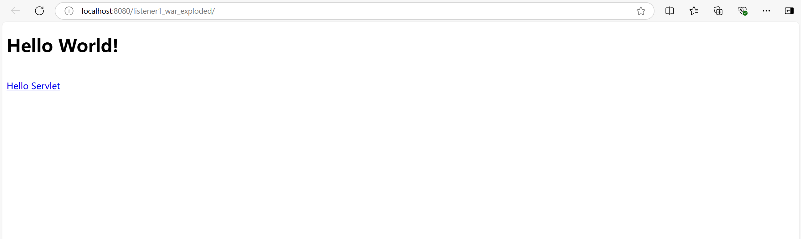
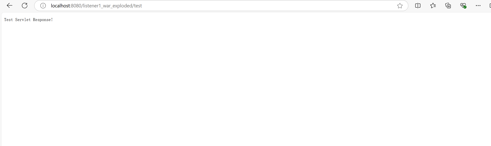
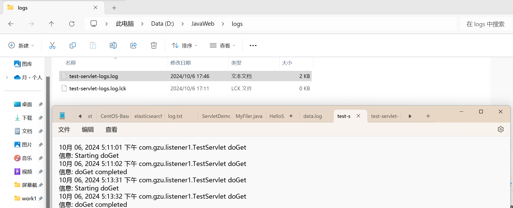

# 作业三：Listener练习


## 一、作业要求

**题目：** 完成请求日志记录（ServletRequestListener）功能

**要求：**


1. 实现一个 ServletRequestListener 来记录每个 HTTP 请求的详细信息。
2. 记录的信息应包括但不限于：

* 请求时间
* 客户端 IP 地址
* 请求方法（GET, POST 等）
* 请求 URI
* 查询字符串（如果有）
* User-Agent
* 请求处理时间（从请求开始到结束的时间）

3. 在请求开始时记录开始时间，在请求结束时计算处理时间。
4. 使用适当的日志格式，确保日志易于阅读和分析。
5. 实现一个简单的测试 Servlet，用于验证日志记录功能。
6. 提供简要说明，解释你的实现方式和任何需要注意的事项。

**评分标准:**

- 正确实现基本的过滤器功能 (70%)
- 代码质量和组织结构 (20%)
- 注释的质量和清晰度 (10%)

**截止日期:** 2024-10-13

## 二、作业内容

`RequestLoggingListener`类实现了`ServletRequestListener`接口，用于监听并记录HTTP请求的生命周期事件。该监听器在请求初始化时记录开始时间以及客户端的IP地址，而在请求销毁时详细记录请求的结束时间、客户端IP、请求方法、请求URI、查询字符串、User-Agent以及请求的处理时间。

日志记录是通过`java.util.logging`库实现的，并将日志信息输出到指定的文件路径"D:\JavaWeb\logs\request-logs.log"中。为了确保日志记录的有效性，日志记录器（Logger）的级别被设置为`Level.ALL`，以记录所有级别的日志信息，同时使用`SimpleFormatter`对日志进行格式化，以提高日志的可读性。

`TestServlet`类用于处理GET和POST请求。在处理请求的过程中，通过模拟延迟（`Thread.sleep(1000)`）来展示请求处理时间的记录。该Servlet记录请求开始和完成的日志信息，并在处理请求后向客户端返回"Test Servlet Response!"字符串。

`RequestLoggingListener.java`

```
package com.gzu.listener1;

import javax.servlet.ServletRequestEvent;
import javax.servlet.ServletRequestListener;
import javax.servlet.http.HttpServletRequest;
import java.io.File;
import java.io.IOException;
import java.util.logging.*;

public class RequestLoggingListener implements ServletRequestListener {
    private static final Logger LOGGER = Logger.getLogger(RequestLoggingListener.class.getName());

    static {
        try {
            // 设置日志文件路径
            File logDir = new File("D:\\JavaWeb\\logs");
            if (!logDir.exists()) {
                logDir.mkdirs(); // 如果目录不存在，则创建目录
            }
            File logFile = new File(logDir, "request-logs.log");
            FileHandler fileHandler = new FileHandler(logFile.getAbsolutePath(), true);
            fileHandler.setLevel(Level.INFO);
            fileHandler.setFormatter(new SimpleFormatter());

            // 清除之前可能存在的所有Handlers
            LOGGER.setUseParentHandlers(false);
            while (LOGGER.getHandlers().length > 0) {
                LOGGER.removeHandler(LOGGER.getHandlers()[0]);
            }

            // 将FileHandler添加到Logger
            LOGGER.addHandler(fileHandler);
            LOGGER.setLevel(Level.ALL);
        } catch (IOException e) {
            LOGGER.log(Level.SEVERE, "Failed to initialize FileHandler", e);
        }
    }

    @Override
    public void requestInitialized(ServletRequestEvent sre) {
        HttpServletRequest request = (HttpServletRequest) sre.getServletRequest();
        long startTime = System.currentTimeMillis();
        request.setAttribute("startTime", startTime);
        LOGGER.info(String.format("Request started at: %s from IP: %s", startTime, request.getRemoteAddr()));
    }

    @Override
    public void requestDestroyed(ServletRequestEvent sre) {
        HttpServletRequest request = (HttpServletRequest) sre.getServletRequest();
        long startTime = (Long) request.getAttribute("startTime");
        long endTime = System.currentTimeMillis();
        long processingTime = endTime - startTime;

        LOGGER.info(String.format("Request Details: " +
                        "Time: %s, " +
                        "Client IP: %s, " +
                        "Method: %s, " +
                        "URI: %s, " +
                        "QueryString: %s, " +
                        "User-Agent: %s, " +
                        "Processing Time: %d ms",
                new Object[]{
                        new java.util.Date(endTime), // 请求时间
                        request.getRemoteAddr(), // 客户端IP地址
                        request.getMethod(), // 请求方法
                        request.getRequestURI(), // 请求URI
                        request.getQueryString(), // 查询字符串
                        request.getHeader("User-Agent"), // User-Agent
                        processingTime // 请求处理时间
                }));
    }
}
```

`TestServlet.java`

```
package com.gzu.listener1;

import jakarta.servlet.ServletException;
import jakarta.servlet.annotation.WebServlet;
import jakarta.servlet.http.HttpServlet;
import jakarta.servlet.http.HttpServletRequest;
import jakarta.servlet.http.HttpServletResponse;
import java.io.File;
import java.io.IOException;
import java.util.logging.*;

@WebServlet("/test")
public class TestServlet extends HttpServlet {
    private static final Logger LOGGER = Logger.getLogger(TestServlet.class.getName());

    static {
        try {
            // 设置日志文件路径
            File logDir = new File("D:\\JavaWeb\\logs");
            if (!logDir.exists()) {
                logDir.mkdirs(); // 如果目录不存在，则创建目录
            }
            File logFile = new File(logDir, "test-servlet-logs.log");
            FileHandler fileHandler = new FileHandler(logFile.getAbsolutePath(), true);
            fileHandler.setLevel(Level.INFO);
            fileHandler.setFormatter(new SimpleFormatter());

            // 清除之前可能存在的所有Handlers
            LOGGER.setUseParentHandlers(false);
            while (LOGGER.getHandlers().length > 0) {
                LOGGER.removeHandler(LOGGER.getHandlers()[0]);
            }

            // 将FileHandler添加到Logger
            LOGGER.addHandler(fileHandler);
            LOGGER.setLevel(Level.ALL);
        } catch (IOException e) {
            LOGGER.log(Level.SEVERE, "Failed to initialize FileHandler", e);
        }
    }

    @Override
    protected void doGet(HttpServletRequest req, HttpServletResponse resp) throws ServletException, IOException {
        try {
            LOGGER.info("Starting doGet");
            Thread.sleep(1000); // 模拟延迟
            LOGGER.info("doGet completed");
        } catch (InterruptedException e) {
            LOGGER.log(Level.SEVERE, "Interrupted during doGet", e);
            Thread.currentThread().interrupt();
        }
        resp.getWriter().write("Test Servlet Response!");
    }

    @Override
    protected void doPost(HttpServletRequest req, HttpServletResponse resp) throws ServletException, IOException {
        doGet(req, resp);
    }
}
```

运行结果：







运行测试Servlet代码后，可以看到logs文件中记录了信息。
