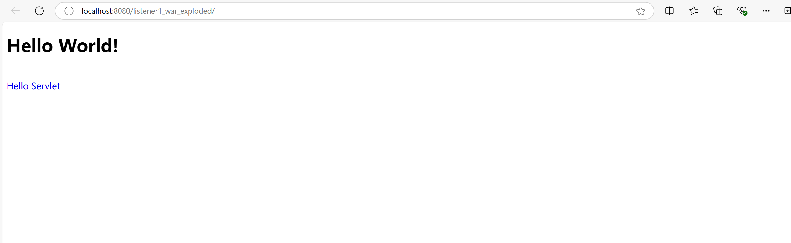
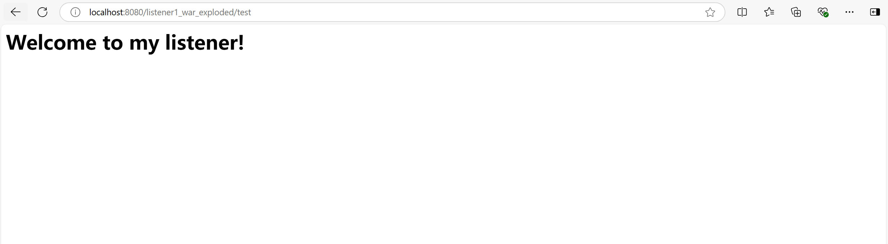
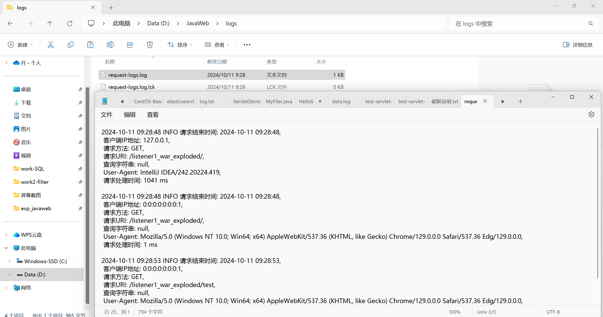

**学院：** 省级示范性学院

**题目：** 《作业三：Listener练习》

**姓名：** 翁未未

**学号：** 2200770273

**班级：** 软工2202

**日期：** 2024-10-06

# Listener练习

## 一、作业要求

**题目：** 完成请求日志记录（ServletRequestListener）功能

**要求：**

1. 实现一个 ServletRequestListener 来记录每个 HTTP 请求的详细信息。
2. 记录的信息应包括但不限于：

* 请求时间
* 客户端 IP 地址
* 请求方法（GET, POST 等）
* 请求 URI
* 查询字符串（如果有）
* User-Agent
* 请求处理时间（从请求开始到结束的时间）

3. 在请求开始时记录开始时间，在请求结束时计算处理时间。
4. 使用适当的日志格式，确保日志易于阅读和分析。
5. 实现一个简单的测试 Servlet，用于验证日志记录功能。
6. 提供简要说明，解释你的实现方式和任何需要注意的事项。

**评分标准:**

- 正确实现基本的过滤器功能 (70%)
- 代码质量和组织结构 (20%)
- 注释的质量和清晰度 (10%)

**提交要求:**

1. 项目打zip交上来，不要target中的内容；
2. 先执行mvn -clean 清除掉target文件再打zip；
3. 一个简短的文档,解释你的实现和任何额外的功能。

**截止日期:** 2024-10-13

## 二、作业内容

1. **创建 `ServletRequestListener` 实现类**： 创建一个名为 `RequestLoggingListener` 的类，它实现了 `ServletRequestListener` 接口，这个类负责在请求初始化和销毁时记录日志。
2. **设置日志记录器**： 在 `RequestLoggingListener` 类中，配置了一个 `Logger` 对象来记录日志，使用 `FileHandler` 来将日志写入到指定的文件中。
3. **自定义日志格式**： 通过自定义 `SimpleFormatter` 的 `format` 方法来定义日志的格式，这个格式包括了请求结束时间、客户端 IP 地址、请求方法、请求 URI、查询字符串、User-Agent 和请求处理时间。
4. **记录请求开始和结束时间**： 在 `requestInitialized` 方法中，将请求的开始时间存储在请求属性中，在 `requestDestroyed` 方法中，计算请求的处理时间，并将所有日志信息记录到日志文件中。
5. **日志记录 **： 使用 `System.out.println` 方法将记录的日志信息存放在logs文件中。

`RequestLoggingListener.java`

```
package com.gzu.listener1;

import jakarta.servlet.ServletRequestEvent;
import jakarta.servlet.ServletRequestListener;
import jakarta.servlet.annotation.WebListener;
import jakarta.servlet.http.HttpServletRequest;
import java.io.File;
import java.io.IOException;
import java.text.SimpleDateFormat;
import java.util.Date;
import java.util.logging.*;

@WebListener
public class RequestLoggingListener implements ServletRequestListener {
    private static final Logger LOGGER = Logger.getLogger(RequestLoggingListener.class.getName());

    static {
        try {
            // 设置日志文件路径
            File logDir = new File("D:\\JavaWeb\\logs");
            if (!logDir.exists()) {
                logDir.mkdirs(); // 如果目录不存在，则创建目录
            }
            File logFile = new File(logDir, "request-logs.log");
            FileHandler fileHandler = new FileHandler(logFile.getAbsolutePath(), true);
            fileHandler.setLevel(Level.INFO);

            // 自定义日志格式器
            fileHandler.setFormatter(new SimpleFormatter() {
                @Override
                public synchronized String format(LogRecord record) {
                    return String.format("%1$tF %1$tT %2$s %3$s%n", new Date(), record.getLevel(), formatMessage(record));
                }
            });

            // 清除之前可能存在的所有Handlers
            LOGGER.setUseParentHandlers(false);
            while (LOGGER.getHandlers().length > 0) {
                LOGGER.removeHandler(LOGGER.getHandlers()[0]);
            }

            // 将FileHandler添加到Logger
            LOGGER.addHandler(fileHandler);
            LOGGER.setLevel(Level.ALL);
        } catch (IOException e) {
            LOGGER.log(Level.SEVERE, "Failed to initialize FileHandler", e);
        }
    }

    @Override
    public void requestInitialized(ServletRequestEvent sre) {
        HttpServletRequest request = (HttpServletRequest) sre.getServletRequest();
        long startTime = System.currentTimeMillis();
        request.setAttribute("startTime", startTime);
    }

    @Override
    public void requestDestroyed(ServletRequestEvent sre) {
        HttpServletRequest request = (HttpServletRequest) sre.getServletRequest();
        Long startTime = (Long) request.getAttribute("startTime");
        if (startTime == null) {
            LOGGER.warning("Start time not recorded, skipping logging for this request.");
            return;
        }
        long endTime = System.currentTimeMillis();
        long processingTime = endTime - startTime;

        SimpleDateFormat dateFormat = new SimpleDateFormat("yyyy-MM-dd HH:mm:ss");
        String formattedEndTime = dateFormat.format(new Date(endTime));

        LOGGER.info(String.format("请求结束时间: %s,\n 客户端IP地址: %s,\n 请求方法: %s,\n 请求URI: %s,\n 查询字符串: %s,\n User-Agent: %s,\n 请求处理时间: %d ms\n",
                formattedEndTime, // 请求结束时间
                request.getRemoteAddr(), // 客户端IP地址
                request.getMethod(), // 请求方法
                request.getRequestURI(), // 请求URI
                request.getQueryString(), // 查询字符串
                request.getHeader("User-Agent"), // User-Agent
                processingTime // 请求处理时间
        ));
    }
}
```

`TestServlet.java`

```
package com.gzu.listener1;

import jakarta.servlet.ServletException;
import jakarta.servlet.annotation.WebServlet;
import jakarta.servlet.http.HttpServlet;
import jakarta.servlet.http.HttpServletRequest;
import jakarta.servlet.http.HttpServletResponse;
import java.io.File;
import java.util.Date;
import java.io.IOException;
import java.util.logging.*;

@WebServlet("/test")
public class TestServlet extends HttpServlet {
    private static final Logger LOGGER = Logger.getLogger(TestServlet.class.getName());

    static {
        try {
            // 设置日志文件路径
            File logDir = new File("D:\\JavaWeb\\logs");
            if (!logDir.exists()) {
                logDir.mkdirs(); // 如果目录不存在，则创建目录
            }
            File logFile = new File(logDir, "test-servlet-logs.log");
            FileHandler fileHandler = new FileHandler(logFile.getAbsolutePath(), true);
            fileHandler.setLevel(Level.INFO);

            // 自定义日志格式器
            fileHandler.setFormatter(new SimpleFormatter() {
                @Override
                public synchronized String format(LogRecord record) {
                    return String.format("%1$tF %1$tT %2$s %3$s%n", new Date(), record.getLevel(), formatMessage(record));
                }
            });

            // 清除之前可能存在的所有Handlers
            LOGGER.setUseParentHandlers(false);
            while (LOGGER.getHandlers().length > 0) {
                LOGGER.removeHandler(LOGGER.getHandlers()[0]);
            }

            // 将FileHandler添加到Logger
            LOGGER.addHandler(fileHandler);
            LOGGER.setLevel(Level.ALL);
        } catch (IOException e) {
            LOGGER.log(Level.SEVERE, "Failed to initialize FileHandler", e);
        }
    }

    @Override
    protected void doGet(HttpServletRequest req, HttpServletResponse resp) throws ServletException, IOException {
        try {
            LOGGER.info("Starting doGet");
            Thread.sleep(1000); // 模拟延迟
            LOGGER.info("doGet completed");
        } catch (InterruptedException e) {
            LOGGER.log(Level.SEVERE, "Interrupted during doGet", e);
            Thread.currentThread().interrupt();
        }
        resp.getWriter().write("<h1>Welcome to my listener!</h1>");
    }

    @Override
    protected void doPost(HttpServletRequest req, HttpServletResponse resp) throws ServletException, IOException {
        doGet(req, resp);
    }
}
```

运行结果：







运行测试Servlet代码后，测试的“welcome to my listener！”存在，接着查看logs文件夹，可以看到里面记录了日志信息。
