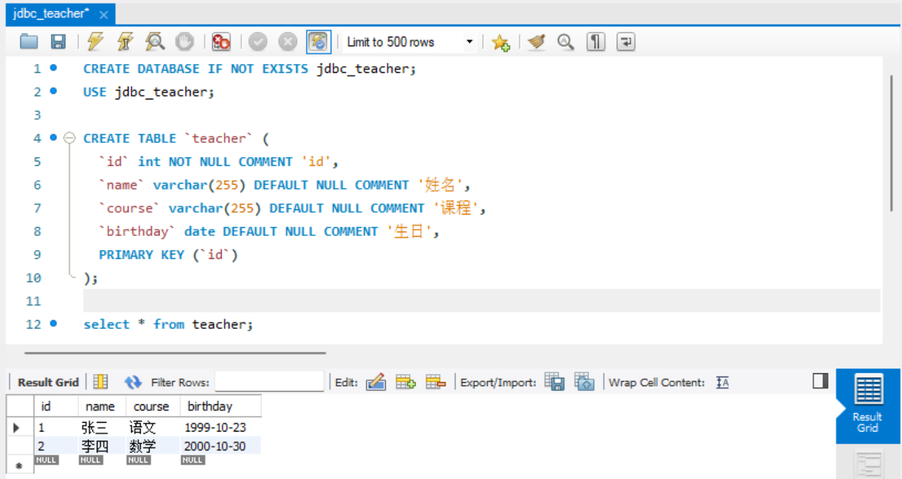
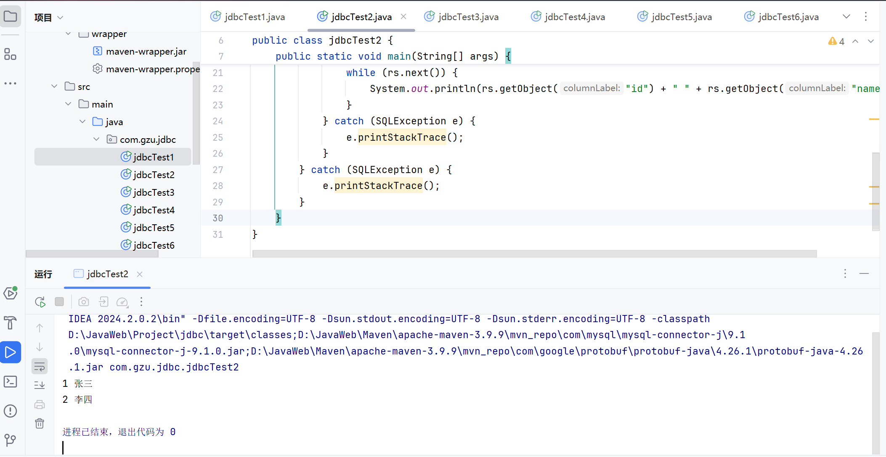
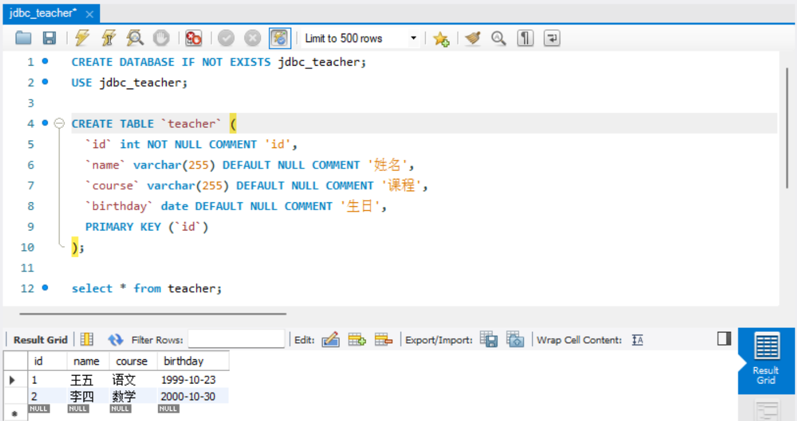
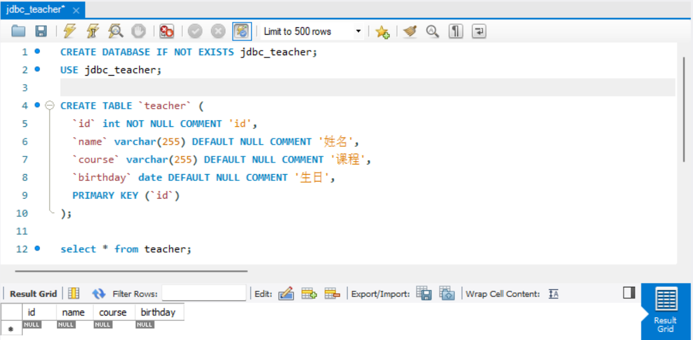
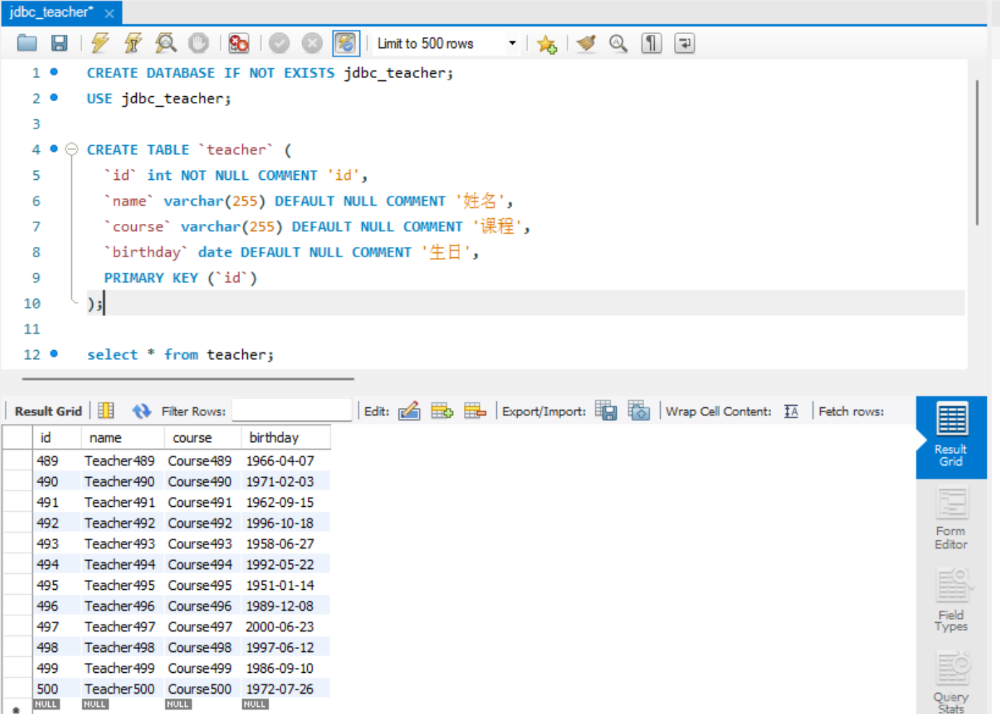
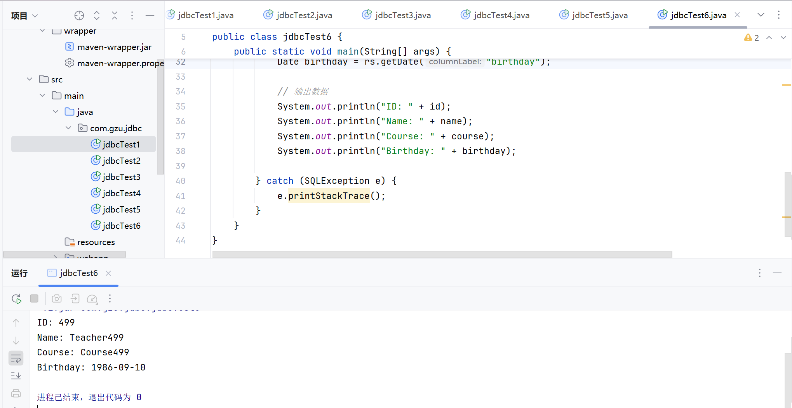

**学院：** 省级示范性学院

**题目：** 《作业五：JDBC作业》

**姓名：** 翁未未

**学号：** 2200770273

**班级：** 软工2202

**日期：** 2024-10-23


# JDBC作业

```
CREATE TABLE `teacher` (
  `id` int NOT NULL COMMENT 'id',
  `name` varchar(255) DEFAULT NULL COMMENT '姓名',
  `course` varchar(255) DEFAULT NULL COMMENT '课程',
  `birthday` date DEFAULT NULL COMMENT '生日',
  PRIMARY KEY (`id`)
);
```

**要求：**

1. 完成teacher的CRUD练习，提供CRUD的代码。
2. 完成teacher表的批量插入练习，插入500个教师，每插入100条数据提交一次。
3. 完成可滚动的结果集练习，只查看结果集中倒数第2条数据。
4. 提交代码即可，但是代码中不要包含taget目录。

**截止日期：2024-10-31**


#### **1.1  jdbcTest1**

```
package com.gzu.jdbc;

import java.sql.*;
import java.time.LocalDate;

//创建
public class jdbcTest1 {
    private static final String url = "jdbc:mysql://localhost:3306/jdbc_teacher?serverTimezone=GMT&characterEncoding=UTF-8";
    private static final String user = "root";
    private static final String passward = "2003729";

    public static void createTeacher(int id, String name, String course, String birthday) {
        String sql = "INSERT INTO teacher (id, name, course, birthday) VALUES (?, ?, ?, ?)";

        try (Connection conn = DriverManager.getConnection(url, user, passward);
             PreparedStatement ps = conn.prepareStatement(sql)) {

            ps.setInt(1, id);
            ps.setString(2, name);
            ps.setString(3, course);
            ps.setDate(4, Date.valueOf(birthday));
            ps.executeUpdate();

        } catch (SQLException e) {
            e.printStackTrace();
        }
    }

    public static void main(String[] args) {
        // 创建两个新的教师记录
        int id1 = 1;
        String name = "张三";
        String course = "语文";
        LocalDate birthday = LocalDate.of(1999, 10, 23); // 假设生日是1980年5月20日
        createTeacher(id1, name, course, birthday.toString());

        int id2 = 2;
        String name2 = "李四";
        String course2 = "数学";
        LocalDate birthday2 = LocalDate.of(2000, 10, 30); // 假设生日是1980年5月20日
        createTeacher(id2, name2, course2, birthday2.toString());
    }
}
```

运行结果：




#### **1.2  jdbcTest2**

```
package com.gzu.jdbc;

import java.sql.*;

//查找 年龄大于22的教师
public class jdbcTest2 {
    public static void main(String[] args) {

        String url = "jdbc:mysql://localhost:3306/jdbc_teacher?serverTimezone=GMT&characterEncoding=UTF-8";
        String user = "root";
        String password = "2003729";
        // 使用当前日期减去生日，然后与22比较
        String sql = "SELECT * FROM teacher WHERE TIMESTAMPDIFF(YEAR, birthday, CURDATE()) > 22";

        try (Connection conn = DriverManager.getConnection(url, user, password);
             PreparedStatement ps = conn.prepareStatement(sql);
        ) {
            // 执行查询
            try (ResultSet rs = ps.executeQuery()) {
                // 输出查询结果
                while (rs.next()) {
                    System.out.println(rs.getObject("id") + " " + rs.getObject("name"));
                }
            } catch (SQLException e) {
                e.printStackTrace();
            }
        } catch (SQLException e) {
            e.printStackTrace();
        }
    }
}
```

运行结果：




#### **1.3  jdbcTest3**

```
package com.gzu.jdbc;

import java.sql.*;

//更新
public class jdbcTest3 {

    public static void main(String[] args) {

        String url = "jdbc:mysql://localhost:3306/jdbc_teacher?serverTimezone=GMT&characterEncoding=UTF-8";
        String user = "root";
        String password = "2003729";
        // 修改数据 id =1, name=张三（改为王五）
        String sql = "UPDATE teacher SET name = ? WHERE id = ?";

        try (Connection conn = DriverManager.getConnection(url, user, password);) {
            conn.setAutoCommit(false);
            try (PreparedStatement ps = conn.prepareStatement(sql);) {
                // 设置参数
                ps.setString(1, "王五"); // name 是字符串类型
                ps.setInt(2, 1); // id 是 INT 类型
                // 执行更新
                int affectedRows = ps.executeUpdate();
                if (affectedRows > 0) {
                    conn.commit();
                    System.out.println("Update successful. Rows affected: " + affectedRows);
                } else {
                    conn.rollback();
                    System.out.println("No rows updated.");
                }
            } catch (SQLException e) {
                conn.rollback();
                e.printStackTrace();
            }
        } catch (SQLException e) {
            e.printStackTrace();
        }
    }
}
```

运行结果：




#### **1.4  jdbcTest4**

```
package com.gzu.jdbc;

import java.sql.*;

//删除
public class jdbcTest4 {
    public static void main(String[] args) {
        String url = "jdbc:mysql://localhost:3306/jdbc_teacher?serverTimezone=GMT&characterEncoding=UTF-8";
        String user = "root";
        String password = "2003729";
        // 删除名字为李四或王五的老师
        String sql = "DELETE FROM teacher WHERE name IN (?, ?)";

        try (Connection conn = DriverManager.getConnection(url, user, password)) {
            conn.setAutoCommit(false);
            try (PreparedStatement ps = conn.prepareStatement(sql)) {
                // 设置参数
                ps.setString(1, "李四");
                ps.setString(2, "王五");
                // 执行删除
                int affectedRows = ps.executeUpdate();
                System.out.println(affectedRows + " rows affected.");
                conn.commit();
            } catch (SQLException e) {
                conn.rollback();
                e.printStackTrace();
            }
        } catch (SQLException e) {
            e.printStackTrace();
        }
    }
}
```

运行结果：




#### **2.  jdbcTest5**

```
package com.gzu.jdbc;

import java.sql.*;
import java.util.Calendar;
import java.util.Random;

public class jdbcTest5 {
    public static void main(String[] args) {
        String url = "jdbc:mysql://localhost:3306/jdbc_teacher?serverTimezone=GMT&characterEncoding=UTF-8";
        String user = "root";
        String password = "2003729";
        String sql = "INSERT INTO teacher (id, name, course, birthday) VALUES (?, ?, ?, ?)";

        try (Connection conn = DriverManager.getConnection(url, user, password)) {
            conn.setAutoCommit(false); // 关闭自动提交
            try (PreparedStatement ps = conn.prepareStatement(sql)) {
                int count = 0;
                for (int i = 1; i <= 500; i++) {
                    ps.setInt(1, i); // 设置 id，id是唯一的
                    ps.setString(2, "Teacher" + i); // 设置 name
                    ps.setString(3, "Course" + i); // 设置 course
                    Calendar calendar = Calendar.getInstance();// 设置随机年份的birthday
                    int year = 1950 + new Random().nextInt(51); // 生成1950到2000年之间的随机年份
                    int month = new Random().nextInt(12) + 1; // 生成1到12月之间的随机月份
                    int day = new Random().nextInt(28) + 1; // 简单起见，假设每个月最多28天
                    calendar.set(year, month - 1, day); // 设置随机 birthday
                    ps.setDate(4, new Date(calendar.getTimeInMillis())); // 设置 birthday

                    ps.addBatch();

                    if (++count % 100 == 0) { // 每100条数据执行一次批处理并提交
                        ps.executeBatch();
                        conn.commit();
                    }
                }
                if (count % 100 != 0) { // 处理剩余的数据
                    ps.executeBatch();
                    conn.commit();
                }
            } catch (SQLException e) {
                conn.rollback();
                e.printStackTrace();
            }
        } catch (SQLException e) {
            e.printStackTrace();
        }
    }
}
```

运行结果：




#### **3.  jdbcTest6**

```
package com.gzu.jdbc;

import java.sql.*;

public class jdbcTest6 {
    public static void main(String[] args) {
        String url = "jdbc:mysql://localhost:3306/jdbc_teacher?serverTimezone=GMT&characterEncoding=UTF-8";
        String user = "root";
        String password = "2003729";
        String sql = "SELECT * FROM teacher";

        try (Connection conn = DriverManager.getConnection(url, user, password);
             PreparedStatement ps = conn.prepareStatement(sql, ResultSet.TYPE_SCROLL_INSENSITIVE, ResultSet.CONCUR_READ_ONLY);
             ResultSet rs = ps.executeQuery()) {

            // 移动到最后一条记录
            rs.last();
            int totalRecords = rs.getRow();

            // 移动到倒数第二条记录
            if (totalRecords >= 2) {
                rs.absolute(totalRecords - 1);
            } else {
                System.out.println("Less than two records found.");
                return;
            }

            // 提取数据
            int id = rs.getInt("id");
            String name = rs.getString("name");
            String course = rs.getString("course");
            Date birthday = rs.getDate("birthday");

            // 输出数据
            System.out.println("ID: " + id);
            System.out.println("Name: " + name);
            System.out.println("Course: " + course);
            System.out.println("Birthday: " + birthday);

        } catch (SQLException e) {
            e.printStackTrace();
        }
    }
}
```

运行结果：




